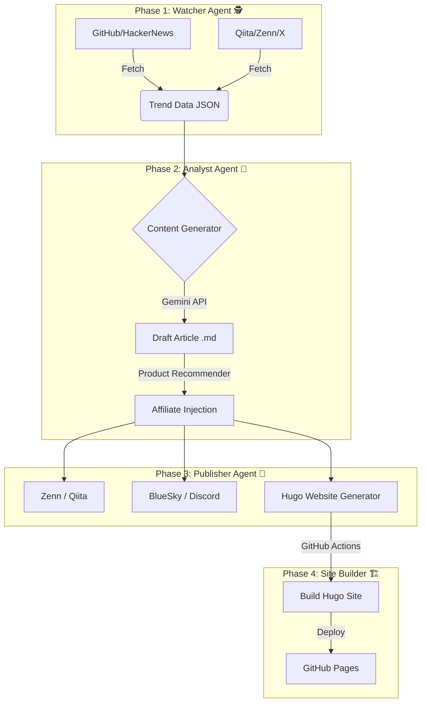

# TechTrend Watch 🚀 (Automated AI Affiliate Bot)

[](https://github.com/shironaganegi/ai-affiliate-bot-1/actions/workflows/daily_report.yml)


**TechTrend Watch** は、日々の技術トレンドを全自動で収集・分析し、記事化して複数のプラットフォーム（Zenn, Qiita, 自社サイト）へ配信する、AI駆動型の完全自動化メディア運用システムです。

## 📖 概要 (Overview)

このプロジェクトは、人間が一切介入することなく、以下のプロセスを毎日自動実行します。

1.  **トレンド収集**: GitHub, HackerNews, ProductHunt, Qiita, Zenn, X(Twitter) から話題のツールや記事を収集。
2.  **選定・執筆**: Gemini 1.5 Pro がトレンドデータを分析し、最もバズる可能性の高いトピックを選定。エンジニア向けの解説記事を執筆。
3.  **収益化**: 記事内容に関連する書籍やガジェット（Amazon/楽天）のアフィリエイトリンクを自動挿入。
4.  **マルチ配信**:
    *   **Zenn/Qiita**: 技術情報共有サイトへ自動投稿。
    *   **BlueSky/Discord**: 更新通知をSNSへ配信。
    *   **Official Website**: Hugoで構築された自社サイトへ記事をデプロイ。

🔗 **Official Website**: [TechTrend Watch](https://shironaganegi.github.io/ai-affiliate-bot-1/)

## 🏗 アーキテクチャ (Architecture)



## ✨ 主な機能 (Features)

*   **Smart Trend Mining**: 過去の投稿履歴を参照し、重複を避けつつ、今最も熱い「旬」のネタをピックアップ。
*   **Engineer-First Affiliate**: 記事内容から「Python」「AWS」などの技術ワードを検出し、エンジニアに刺さる関連書籍を自動推薦。見つからない場合は鉄板ガジェット（HHKB, ロジクール等）をフォールバック表示。
*   **Zero-Cost Operation**: GitHub Actions と GitHub Pages を活用し、**サーバー代・ドメイン代・運用費すべて0円**で稼働。
*   **SEO Optimized**: Hugo + PaperMod テーマによる高速な自社サイト構築。Zenn等へのCanonical Link設定済み。

## 📂 ディレクトリ構成

```text
.
├── .github/workflows/   # GitHub Actions (自動実行定義)
├── agent_watcher/       # トレンド収集エージェント
├── agent_analyst/       # 分析・公構成・執筆エージェント
├── agent_publisher/     # 配信・CMS連携エージェント
├── articles/            # 生成された記事のアーカイブ
├── data/                # トレンドデータ・重複排除用履歴
├── shared/              # 共通ユーティリティ
└── website/             # Hugo 自社サイト・ソースコード
```

## 🚀 セットアップ (Local Development)

### 1. インストール
```bash
git clone https://github.com/shironaganegi/ai-affiliate-bot-1.git
cd ai-affiliate-bot-1
pip install -r requirements.txt
```

### 2. 環境変数設定 (`.env`)
以下の変数を設定してください。
```ini
GEMINI_API_KEY=your_key
RAKUTEN_APP_ID=your_id
RAKUTEN_AFFILIATE_ID=your_id
QIITA_ACCESS_TOKEN=your_token
BLUESKY_HANDLE=your_handle
BLUESKY_PASSWORD=your_password
DISCORD_WEBHOOK_URL=your_webhook
ZENN_AUTO_PUBLISH=false # trueで自動公開
```

### 3. 自社サイト (Hugo) の確認
```bash
cd website
hugo server -D
```

---
Author: **TechTrend Observer**
Powered by Gemini & GitHub Actions
