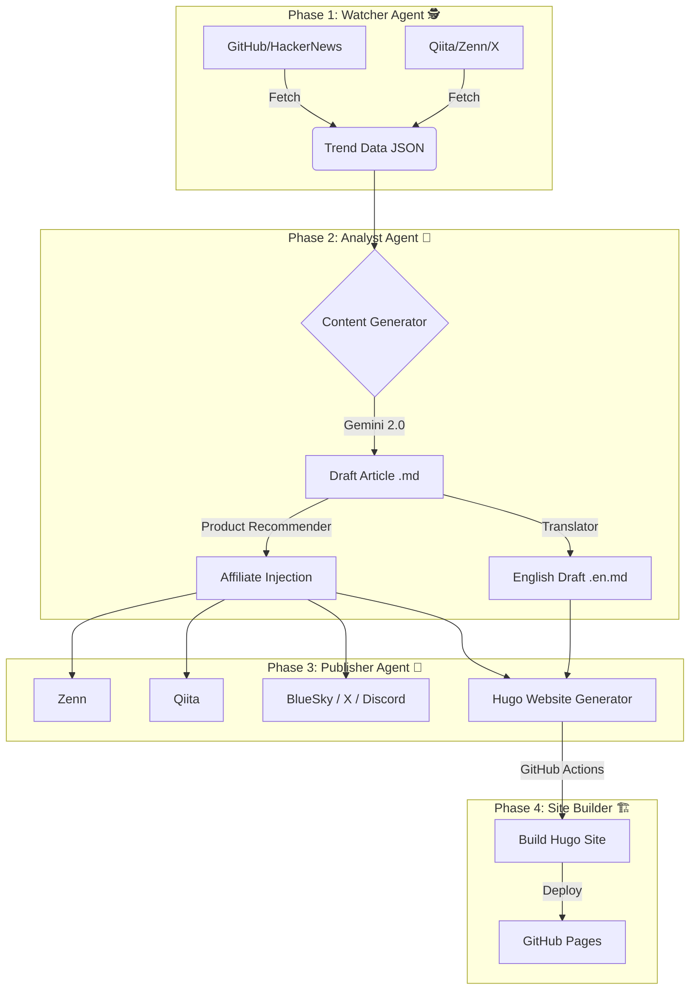

# TechTrend Watch 🚀 (Automated AI Affiliate Bot)

[](https://github.com/shironaganegi/ai-affiliate-bot-1/actions/workflows/daily_report.yml)


**TechTrend Watch** は、日々の技術トレンドを全自動で収集・分析し、記事化して複数のプラットフォーム（Zenn, Qiita, 自社サイト）へ配信する、AI駆動型の完全自動化メディア運用システムです。

## 📖 概要 (Overview)

このプロジェクトは、人間が一切介入することなく、以下のプロセスを**毎日3回（07:00, 12:00, 19:00 JST）** 自動実行します。

1.  **トレンド収集**: GitHub, HackerNews, ProductHunt, Qiita, Zenn, X(Twitter) から話題のツールや記事を収集。
2.  **選定・執筆**: Gemini 2.0 Flash がトレンドデータを分析し、最もバズる可能性の高いトピックを選定。エンジニア向けの解説記事を執筆。
3.  **多言語対応**: 日本語記事に加え、英語翻訳版も自動生成。
4.  **収益化**: 記事内容に関連する技術書やガジェットのアフィリエイトリンクを自動挿入。
5.  **マルチ配信**:
    *   **Zenn**: 日本語記事をドラフト投稿（自動公開可）。
    *   **Official Website**: Hugoで構築された自社サイトへ日英両方の記事をデプロイ。
    *   **Qiita/BlueSky/X(Twitter)**: 各プラットフォームへ拡散。
    *   **Discord**: 運営者へ通知。

🔗 **Official Website**: [TechTrend Watch](https://shironaganegi.github.io/ai-affiliate-bot-1/)

## 🏗 アーキテクチャ (Architecture)



## ✨ 主な機能 (Features)

*   **Triple-Daily Update**: 1日3回（朝・昼・夜）の高頻度更新で、最新トレンドを逃さずキャッチ。
*   **Smart Trend Mining**: 過去の投稿履歴を参照し、重複を避けつつ、今最も熱い「旬」のネタをピックアップ。
*   **Global Reach**: 日本語記事だけでなく、英語版記事も生成しグローバルなSEO需要に対応。
*   **Engineer-First Affiliate**: 記事内容から「Python」「AWS」などの技術ワードを検出し、エンジニアに刺さる関連書籍を自動推薦。
*   **Zero-Cost Operation**: GitHub Actions と GitHub Pages を活用し、**サーバー代・ドメイン代・運用費すべて0円**で稼働。
*   **SEO Optimized**: Hugo + PaperMod テーマによる高速な自社サイト構築。

## 📂 ディレクトリ構成 (Refactored)

```text
.
├── .github/workflows/   # GitHub Actions (自動実行定義)
├── agent_watcher/       # トレンド収集エージェント
├── agent_analyst/       # 分析・執筆エージェント
│   ├── content_generator.py
│   └── llm.py           # Gemini API連携
├── agent_publisher/     # 配信エージェント
│   ├── distributor.py   # 配信オーケストレータ
│   └── platforms/       # 各プラットフォーム連携 (Qiita, Twitter, etc.)
├── articles/            # 日本語記事アーカイブ (Zenn互換)
├── data/                # データストア
│   ├── articles_en/     # 英語記事アーカイブ
│   ├── prompts/         # AIプロンプト定義
│   └── ads.json         # 広告設定
├── shared/              # 共通基盤 (Config, Logger)
└── website/             # Hugo 自社サイト
```

## 🚀 セットアップ (Local Development)

### 1. インストール
```bash
git clone https://github.com/shironaganegi/ai-affiliate-bot-1.git
cd ai-affiliate-bot-1
pip install -r requirements.txt
```

### 2. 環境変数設定 (`.env`)
以下の変数を設定してください。
```ini
GEMINI_API_KEY=your_key
RAKUTEN_APP_ID=your_id
RAKUTEN_AFFILIATE_ID=your_id
QIITA_ACCESS_TOKEN=your_token
BLUESKY_HANDLE=your_handle
BLUESKY_PASSWORD=your_password
DISCORD_WEBHOOK_URL=your_webhook
X_API_KEY=your_key
X_API_SECRET=your_secret
X_ACCESS_TOKEN=your_token
X_ACCESS_SECRET=your_secret
ZENN_AUTO_PUBLISH=false
```

---
Author: **TechTrend Observer**
Powered by Gemini 2.0 & GitHub Actions
